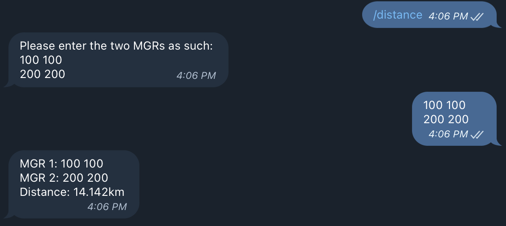
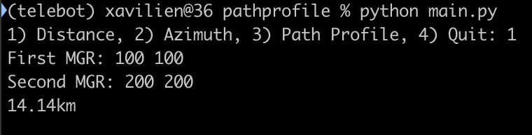
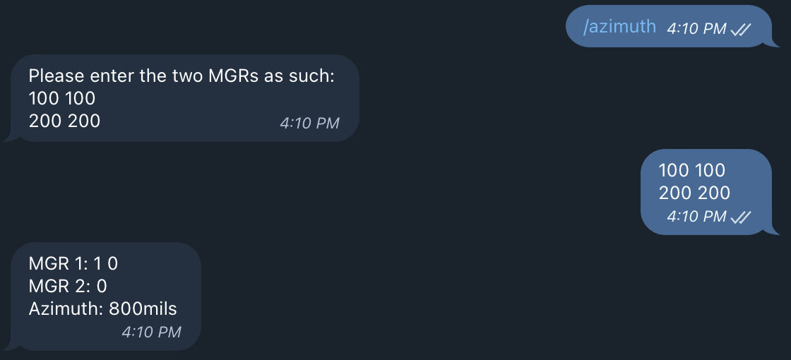
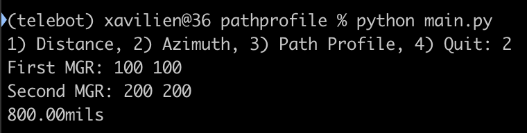
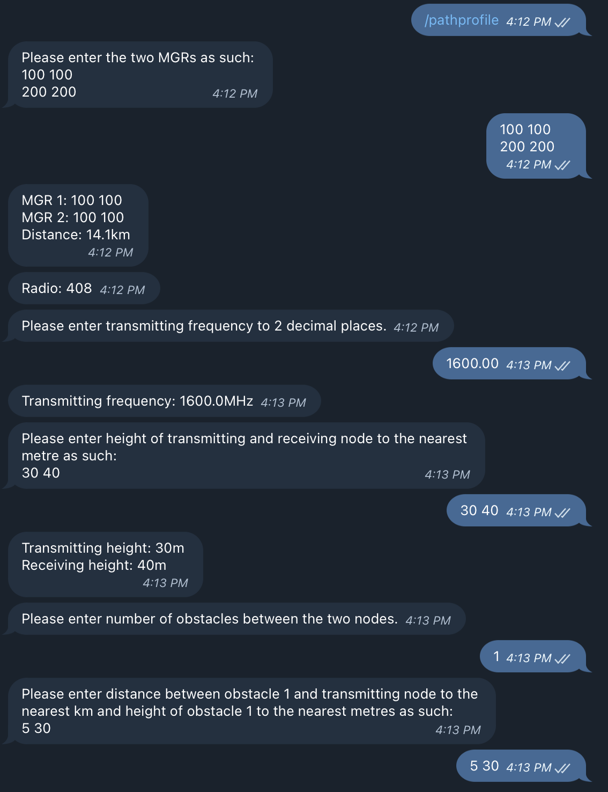
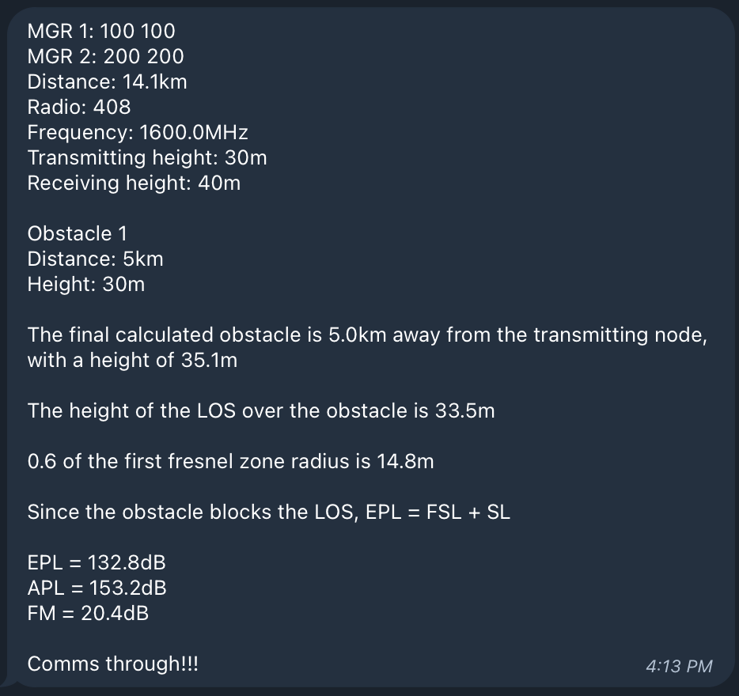

# Path Profile Bot

## Overview
Telegram Bot to calculate Ultra-High Frequency (UHF) path profile, distance and azimuth between 2 points on a map. You can either run it in the CLI or using the following [telegram bot](https://telegram.me/pathprofile_bot) (Unfortunately, if I do not manage to find an alternative to heroku, this will not work after 28 Nov 2022 as heroku is removing its free services and so you will have to run the bot yourself before using it).

## Usage
### A note on Map Grid References (MGRs)
This bot uses 6-digit MGRs separated by a space between the Eastings and the Northings. E.g. `100 100`. Each unit is 100m, e.g. `101 100` is 100m away from `100 100`.

### Calculating Distance
Running `/distance` on the telegram bot or choosing option 1 in the CLI allows you to calculate the distance (in km) between two MGRs. For the telegram bot, enter the 2 MGRs in a single message separated by a carriage return, while for the CLI, each MGR is inputted as a separate entry.

### Calculating Azimuth
Running `/azimuth` on the telegram bot or choosing option 2 in the CLI allows you to calculate the azimuth (in mils) between two MGRs. For the telegram bot, enter the 2 MGRs in a single message separated by a carriage return, while for the CLI, each MGR is inputted as a separate entry.

### Calculating Path Profile
Running `/pathprofile` on the telegram bot or choosing option 3 in the CLI allows you to calculate the path profile between two MGRs. A sample telegram conversation with the bot has been provided. A similar conversation will occur when running the CLI.

## How to Run
This section is for those who would like to run their own telegram bot with the path profile code or use the CLI.

### Requirements
- Minimally `python3.7` (or whatever the minimum python requirements of [python-telegram-bot](https://python-telegram-bot.readthedocs.io) are)
- `pip install python-telegram-bot`

### Telegram Bot
First, you will need to create a telegram bot using [BotFather](https://t.me/botfather).

Next, you will need to set the `PATHPROFILE_TOKEN` to your telegram bot API token in your environment using `export PATHPROFILE_TOKEN="[YOUR_API_TOKEN]"`.

If you intend to run a polling server (i.e. if you are running it on your own machine), you will need to uncomment the line `updater.start_polling()` on line 427 and comment lines 429 and 430. Then you can just run `python pathprofile_bot.py`.

Otherwise, you can follow [this article](https://towardsdatascience.com/how-to-deploy-a-telegram-bot-using-heroku-for-free-9436f89575d2) on how to publish the bot to a service like heroku.

### CLI
Simply run `python main.py`.
